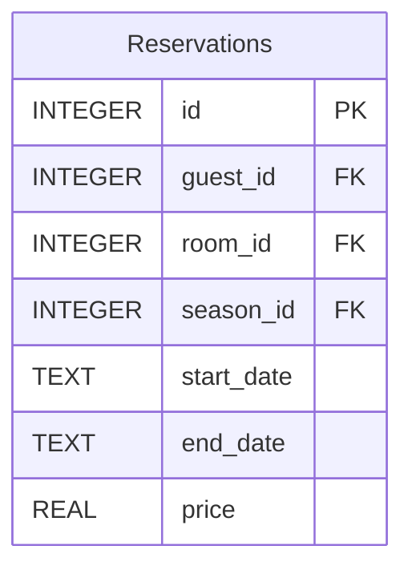

# Reservation Service


## Overview

The Reservation Service is a critical component of the Hotel Kong Arthur management system, handling all aspects of room reservations. Built with Flask and SQLite, this microservice provides a robust API for managing guest reservations, including creation and retrieval operations. The service integrates with the Room Inventory Service and Guest Service to provide comprehensive reservation management capabilities.

**Key Features:**
- Create and retrieve reservations
- Integration with Guest and Room Inventory services
- Season-based pricing calculation
- Comprehensive error handling
- Docker containerization
- Modular Flask architecture

## Project Structure

```bash
ReservationService/
├── api/
│   └── reservation_routes.py          # API endpoints implementation
├── csv/
│   └── international_names_with_rooms_1000.csv  # Sample data
├── database/
│   ├── connection.py                  # Database connection handler
│   ├── initialization.py              # Database setup and initialization
│   └── reservation_inventory.db       # SQLite database
├── repositories/
│   └── reservation_repository.py      # Data access layer
├── app.py                            # Main application entry point
├── Dockerfile                        # Docker configuration
├── requirements.txt                  # Python dependencies
└── README.md                        # Project documentation
```

## Database Schema



## API Documentation

| Method | Endpoint | Description | Request Body | Response (200) | Error Responses |
|--------|----------|-------------|--------------|----------------|-----------------|
| GET | `/api/v1/reservations` | Get all reservations | N/A | `[{"reservation_id": 1, "guest": {...}, "room": {...}, "reservation_details": {...}}]` | 404: `{"error": "No reservations found"}` |
| GET | `/api/v1/reservations/{id}` | Get reservation by ID | N/A | `{"reservation_id": 1, "guest": {...}, "room": {...}, "reservation_details": {...}}` | 404: `{"error": "Reservation not found"}` |
| POST | `/api/v1/reservations/new` | Create new reservation | `{"guest_id": 1, "room_id": 1, "start_date": "2024-01-01", "end_date": "2024-01-05"}` | `{"message": "Reservation created successfully"}` | 400: `{"error": "Missing required field(s)"}` |

## Environment Variables

The service requires the following environment variables:

```bash
GUEST_SERVICE_URL=http://guest_service:5001
ROOM_INVENTORY_SERVICE_URL=http://room_inventory_service:5002
```

## Installation & Setup

### Local Development

```bash
# Create and activate virtual environment
python3 -m venv .venv
source .venv/bin/activate

# Install dependencies
pip install -r requirements.txt

# Run the application
python3 app.py
```

### Docker Setup

1. Create Docker network (if not exists):
```bash
docker network create microservice-network
```

2. Build and run the service:
```bash
# Build image
docker build -t reservation_service . && docker image prune -f

# Run container
docker run -d \
  -p 5003:5003 \
  -e GUEST_SERVICE_URL=http://guest_service:5001 \
  -e ROOM_INVENTORY_SERVICE_URL=http://room_inventory_service:5002 \
  --name reservation_service \
  --network microservice-network \
  reservation_service
```

## Testing

### Prerequisites
- Docker Desktop installed and running
- Python 3.x (for local development)
- Postman or similar API testing tool

## Postman Collection
You can use the following API endpoints in Postman or any HTTP client to test the application.

1. **Get reservations by id**
   - **Method:** GET
   - **Request:** `http://127.0.0.1:5003/api/v1/reservations/1000`
   - **Response Example:**
```json
{
    "guest": {
        "country": "Canada",
        "first_name": "Liam",
        "guest_id": 1000,
        "last_name": "Rossi"
    },
    "reservation_details": {
        "days_rented": 4,
        "end_date": "2024-11-01",
        "price": 10740.0,
        "start_date": "2024-10-28",
        "season": MID

    },
    "reservation_id": 1000,
    "room": {
        "room_id": 5,
        "room_type": "Suite"
    }
}
```

---

#### Created by Hotel Kong Arthur Team
