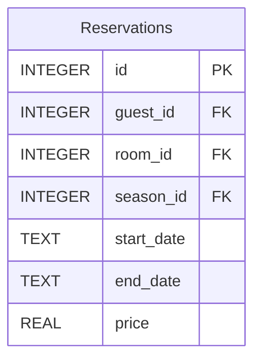

# Reservation Service


## Overview

The Reservation Service is a critical part of the Hotel Kong Arthur management system, responsible for handling all aspects related to room reservations. This microservice is built using Flask and SQLite, providing a robust API for managing guest reservations, including creation, retrieval, and data management. The service communicates with other microservices such as the Room Inventory Service and Guest Service, ensuring seamless integration and functionality.

**Key Features:**
- Create new reservations with validation
- Retrieve reservation details including guest and room information
- Handle season-based pricing for reservations
- API endpoint error handling and response formatting
- Docker containerization for easy deployment
- Modular architecture using Flask Blueprints

## Project Structure

```bash
ReservationService/
├── api/                                         # API routes for reservations
│   └── reservation_routes.py                    # 
├── csv/                                         
│   └── international_names_with_rooms_1000.csv  # CSV file containing sample data
├── database/                                    # Database connection and initialization scripts
│   ├── connection.py                            
│   ├── initialization.py                        
│   └── reservation_inventory.db                 # SQLite database for reservations
├── repositories/                                # Data access layer for reservation operations
│   └── reservation_repository.py                
├── app.py                                       # Main application entry point
├── Dockerfile                                   # Docker configuration file
├── requirements.txt                             # Python dependencies
└── README.md                                    # Project documentation
```

## Database Schema


## API Documentation

| Method | Endpoint                      | Description                                          | Request Body                          | Response (200)                                                      | Error Responses                        |
|--------|-------------------------------|------------------------------------------------------|---------------------------------------|---------------------------------------------------------------------|----------------------------------------|
| GET    | /api/v1/reservations          | Get all reservations                                 | N/A                                   | `[{"id": 1, "guest_id": 1, "room_id": 1, ...}]`                  | 404: `{"error": "No reservations found"}` |
| GET    | /api/v1/reservations/{id}     | Get reservation by ID                               | N/A                                   | `{"id": 1, "guest_id": 1, "room_id": 1, ...}`                     | 404: `{"error": "Reservation not found"}` |
| POST   | /api/v1/reservations/new      | Create a new reservation                             | `{"guest_id": 1, "room_id": 1, ...}`| `{"message": "Reservation made successfully"}`                     | 400: `{"error": "Missing required fields"}` |

---

## Testing

### Prerequisites
- Docker Desktop
- Python 3.x (for local development)
- Postman (for testing)

## Installation

### Local Development Setup
```bash
python3 -m venv .venv
source .venv/bin/activate
pip install -r requirements.txt
python3 app.py
```

### Docker Setup
```bash
docker build -t guest_service . && docker image prune -f
docker build -t room_inventory_service . && docker image prune -f
docker build -t reservation_service . && docker image prune -f
```

docker build -t reservation_service . && docker image prune -f
docker rm -f reservation_service && docker run -d \
  -p 5003:5003 \
  -e GUEST_SERVICE_URL=http://guest_service:5001 \
  -e ROOM_INVENTORY_SERVICE_URL=http://room_inventory_service:5002 \
  --name reservation_service \
  --network microservice-network \
  reservation_service


```bash
# Run guest_service
docker run -d \
  --name guest_service \
  --network microservice-network \
  -p 5001:5001 \
  guest_service
```
```bash
# Run room_inventory_service
docker run -d \
  -p 5002:5002 \
  --name room_inventory_service \
  --network microservice-network \
  room_inventory_service
```
```bash
# Run reservation_service
docker rm -f reservation_service && docker run -d \
  -p 5003:5003 \
  -e GUEST_SERVICE_URL=http://guest_service:5001 \
  -e ROOM_INVENTORY_SERVICE_URL=http://room_inventory_service:5002 \
  --name reservation_service \
  --network microservice-network \
  reservation_service
```
## Postman Collection
You can use the following API endpoints in Postman or any HTTP client to test the application.

1. **Get reservations by id**
   - **Method:** GET
   - **Request:** `http://127.0.0.1:5003/api/v1/reservations/1000`
   - **Response Example:**
```json
{
    "guest": {
        "country": "Canada",
        "first_name": "Liam",
        "guest_id": 1000,
        "last_name": "Rossi"
    },
    "reservation_details": {
        "days_rented": 4,
        "end_date": "2024-11-01",
        "price": 10740.0,
        "start_date": "2024-10-28"
    },
    "reservation_id": 1000,
    "room": {
        "room_id": 5,
        "room_type": "Suite"
    }
}
```

---

#### Created by Hotel Kong Arthur Team
